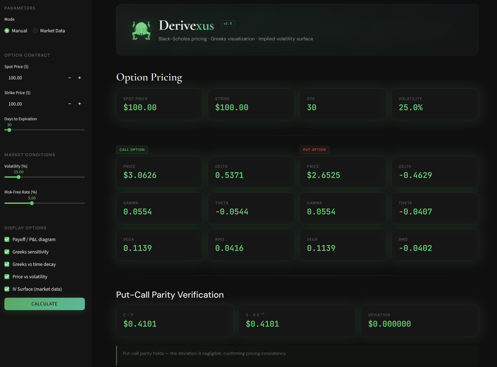
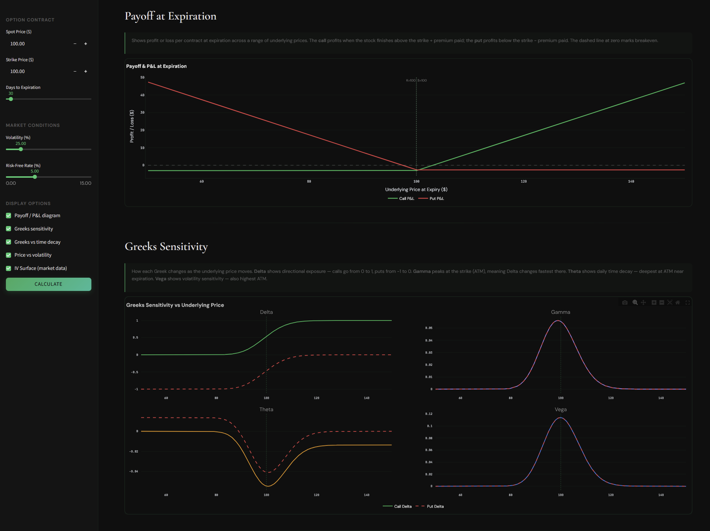
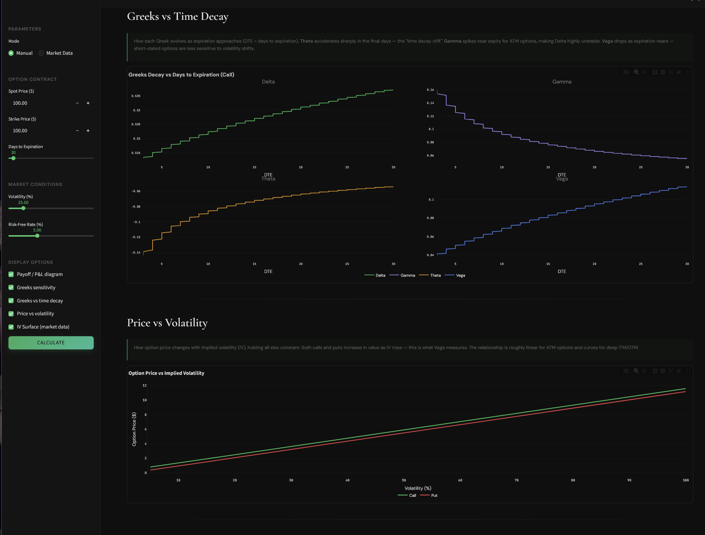
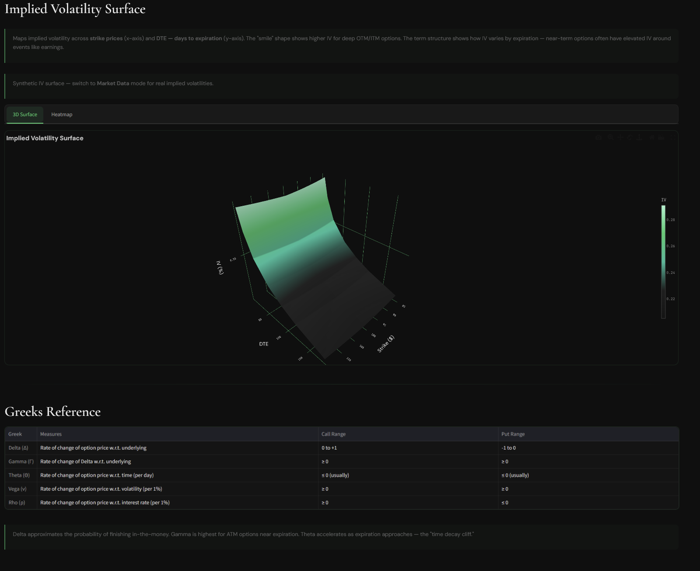
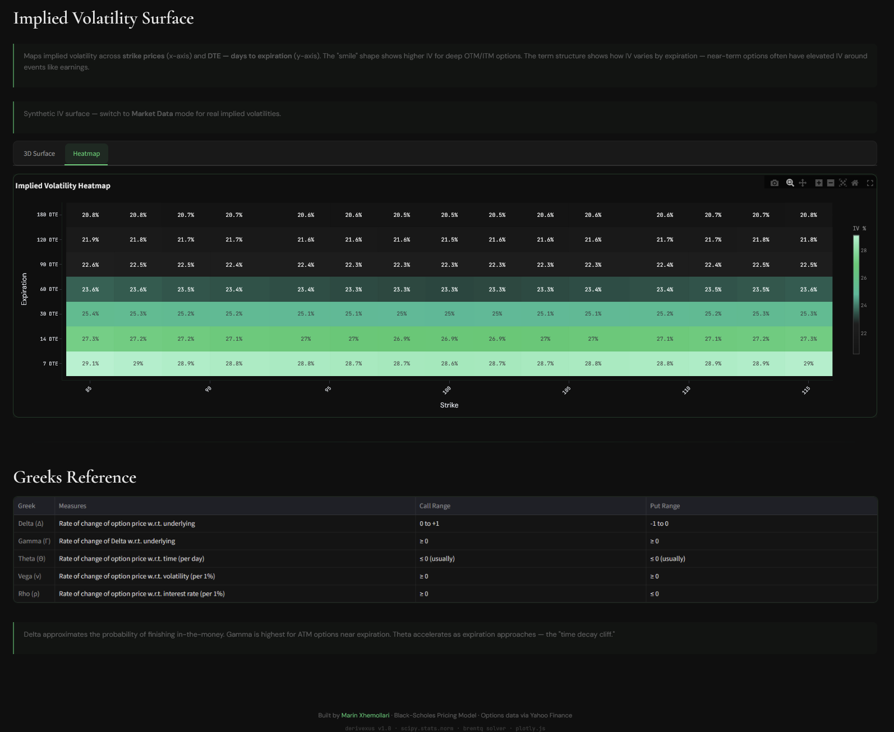

# Derivexus

Options pricing and Greeks visualization engine built with Python and Streamlit. Implements the generalized Black-Scholes-Merton model (with continuous dividend yield) for European options, full Greeks analysis, implied volatility surface construction, and sensitivity charts.

**[Live Demo →](https://derivexus-YOUR-URL.streamlit.app)**

---

## Screenshots







---

## Features

- **Black-Scholes-Merton Pricing** — European call and put pricing with continuous dividend yield support
- **Full Greeks Suite** — Delta, Gamma, Theta, Vega, Rho for both calls and puts (dividend-adjusted)
- **Greeks Sensitivity** — interactive charts showing how Greeks change across underlying price
- **Greeks Time Decay** — visualize how Greeks evolve as expiration approaches
- **Payoff & P&L Diagrams** — at-expiration payoff with premium cost overlay
- **Implied Volatility Solver** — Brent's method to back out IV from market prices
- **IV Surface** — 3D surface and heatmap from live options chain data (yfinance)
- **Put-Call Parity** — automatic verification of pricing consistency (dividend-adjusted form)
- **Price vs Volatility** — sensitivity of option price to implied volatility changes
- **Two Modes** — manual parameter input or live market data with auto-fetched dividend yield
- **Greeks Reference** — built-in reference table with interpretation guide

## Tech Stack

| Layer | Technology |
|-------|-----------|
| Frontend | Streamlit |
| Visualization | Plotly |
| Pricing Model | Generalized Black-Scholes-Merton (scipy.stats.norm) |
| IV Solver | Brent's method (scipy.optimize.brentq) |
| Data | yfinance, Pandas, NumPy |
| Deployment | Streamlit Cloud |

## How It Works

### Generalized Black-Scholes-Merton Formula

For a European option on an underlying with continuous dividend yield q:

```
C = S·e⁻ᵠᵀ·N(d₁) − K·e⁻ʳᵀ·N(d₂)
P = K·e⁻ʳᵀ·N(−d₂) − S·e⁻ᵠᵀ·N(−d₁)
```

Where:
- d₁ = [ln(S/K) + (r − q + σ²/2)·T] / (σ·√T)
- d₂ = d₁ − σ·√T
- N(·) = standard normal CDF
- S = spot price, K = strike, T = time to expiry (years)
- r = risk-free rate (continuous), q = dividend yield (continuous), σ = volatility

Setting q = 0 recovers the classic Black-Scholes model.

### Greeks (dividend-adjusted)

| Greek | Call Formula | Interpretation |
|-------|--------------|----------------|
| Delta (Δ) | e⁻ᵠᵀ·N(d₁) | Price sensitivity to underlying |
| Gamma (Γ) | e⁻ᵠᵀ·φ(d₁) / (S·σ·√T) | Delta sensitivity to underlying |
| Theta (Θ) | −S·e⁻ᵠᵀ·φ(d₁)·σ/(2√T) − r·K·e⁻ʳᵀ·N(d₂) + q·S·e⁻ᵠᵀ·N(d₁) | Time decay per day |
| Vega (ν) | S·e⁻ᵠᵀ·φ(d₁)·√T | Sensitivity to volatility (per 1%) |
| Rho (ρ) | K·T·e⁻ʳᵀ·N(d₂) | Sensitivity to interest rate (per 1%) |

Where φ(·) is the standard normal PDF. Put Greeks follow the analogous dividend-adjusted formulas.

### Put-Call Parity

Under BSM with continuous dividends:

```
C − P = S·e⁻ᵠᵀ − K·e⁻ʳᵀ
```

The app verifies this holds at every pricing run.

### Implied Volatility

Given a market price, IV is solved numerically using Brent's method (scipy.optimize.brentq) on the residual:

```
BS(S, K, T, r, σ, q) − market_price = 0
```

with σ bracketed in [0.001, 5.0].

## Assumptions & Limitations

- European exercise only (no early exercise / American-style options)
- Continuous dividend yield (discrete dividends not modeled — reasonable approximation for index options and short-dated single-name options)
- Constant volatility and rates over the option's life
- IV surface uses linear interpolation across strikes within each expiration (no SVI/SABR arbitrage-free fitting)

## Running Locally

```bash
git clone https://github.com/Marin-X/Derivexus.git
cd Derivexus
pip install -r requirements.txt
streamlit run app.py
```

## References

- Black, F. and Scholes, M. (1973). "The Pricing of Options and Corporate Liabilities." *Journal of Political Economy*, 81(3), 637–654.
- Merton, R. C. (1973). "Theory of Rational Option Pricing." *Bell Journal of Economics and Management Science*, 4(1), 141–183.
- Hull, J. C. (2018). *Options, Futures, and Other Derivatives*, 10th ed. Pearson.

---

Built by [Marin Xhemollari](https://marinxhemollari.com) · [Portfolio](https://marinxhemollari.com) · [LinkedIn](https://linkedin.com/in/marinxhemollari)
